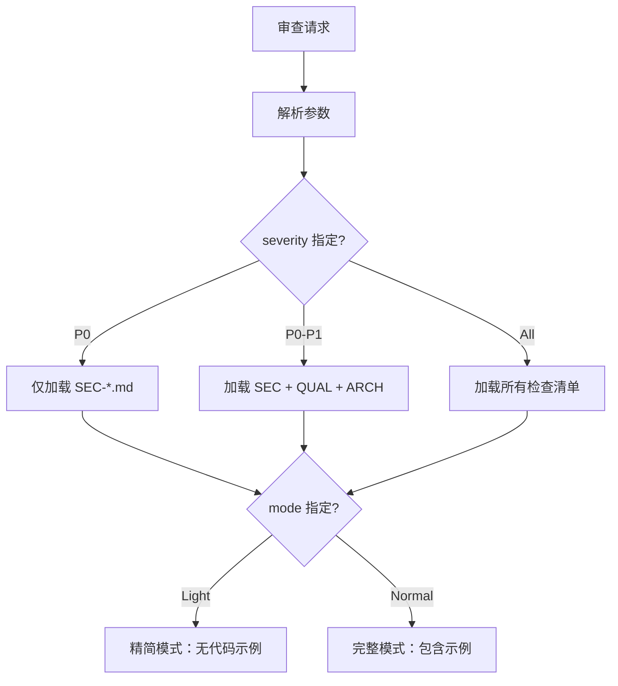

# 规则系统设计文档

## 📋 设计概述

本文档描述了 Android Code Review v2.0 的规则系统设计，这是从 V1.0 升级的**核心基础**。

---

## 🎯 设计目标

### 当前问题（V1.0）

```
agents/android-code-reviewer.md
└── 500+ 行硬编码规则
    ├── 所有规则一次性加载
    ├── 无法单独启用/禁用
    ├── 无规则 ID 体系
    ├── 无元数据
    └── 初始 Token 消耗：30k+
```

### 目标状态（v2.0）

```
rules/
├── rule-metadata.yaml        # 规则注册表
├── rule-disable.yaml         # 运行时禁用
└── rule-priority.yaml        # 优先级策略

references/
├── sec-001-to-010-security.md     # P0 安全规则
├── qual-001-to-010-quality.md     # P1 质量规则
├── arch-001-to-008-architecture.md # P1 架构规则
├── jetp-001-to-008-jetpack.md      # P1 Jetpack 规则
├── perf-001-to-006-performance.md  # P2 性能规则
└── prac-001-to-008-practices.md    # P3 最佳实践

Token 消耗：按需加载，初始消耗降低 80%+
```

---

## 📐 规则 ID 体系

### 命名规范

```
[分类缩写]-[序号]
        |
        +-- 001-999（三位数字，支持扩展）
```

### 分类映射

| 前缀 | 分类 | 严重等级 | 优先级权重 | 规则数量 |
|------|------|----------|-----------|----------|
| **SEC** | Security | P0 | 100 | 10 |
| **QUAL** | Code Quality | P1 | 70 | 10 |
| **ARCH** | Architecture | P1 | 80 | 8 |
| **JETP** | Jetpack/Kotlin | P1 | 75 | 8 |
| **PERF** | Performance | P2 | 40 | 6 |
| **PRAC** | Best Practices | P3 | 20 | 8 |

### ID 分配示例

```yaml
Security (P0):
  SEC-001 → 硬编码凭证
  SEC-002 → 不安全数据存储
  SEC-003 → 不安全 Intent
  ...
  SEC-010 → 加密算法缺陷

Code Quality (P1):
  QUAL-001 → 超长函数
  QUAL-002 → 超长文件
  QUAL-003 → 深度嵌套
  ...
  QUAL-010 → 测试覆盖不足
```

---

## 📦 文件组织结构

### 1. 规则元数据 (`rules/rule-metadata.yaml`)

**核心结构**：

```yaml
rules:
  - rule_id: SEC-001
    severity: P0
    category: Security
    enabled: true
    confidence_threshold: 0.8
    priority_weight: 100
    global_priority: true

    checklist_path: references/sec-001-hardcoded-secret.md
    checklist_token_estimate: 800

    patterns:
      - regex: '...'
        confidence_contribution: 0.7

    tags: [security, credentials]
```

**关键字段说明**：

| 字段 | 说明 | 示例 |
|------|------|------|
| `rule_id` | 全局唯一标识 | `SEC-001` |
| `severity` | 严重等级 | `P0/P1/P2/P3` |
| `enabled` | 是否启用 | `true/false` |
| `confidence_threshold` | 置信度阈值 | `0.8` |
| `priority_weight` | 优先级权重（100-20） | `100` |
| `global_priority` | 是否为核心规则 | `true` |
| `checklist_path` | 检查清单文件路径 | `references/...` |
| `checklist_token_estimate` | Token 预估 | `800` |

### 2. 运行时禁用 (`rules/rule-disable.yaml`)

**用途**：临时禁用规则，无需修改主元数据

```yaml
disabled_rules:
  - rule_id: PRAC-001
    reason: "项目遗留代码"
    disabled_until: "2025-03-31"

severity_based_disables:
  lightweight_mode:
    disabled_categories:
      - PRAC
```

### 3. 优先级策略 (`rules/rule-priority.yaml`)

**用途**：定义项目规则与全局规则的优先级

```yaml
priority_strategy:
  global_core_rules: ["SEC-*", "ARCH-001"]
  project_rule_strategy: "append"
  conflict_resolve: "global_first"
```

### 4. 检查清单 (`references/*.md`)

**用途**：详细的检查规则，按需加载

```markdown
# SEC-001: 硬编码凭证检测

## 检测目标
...

## 代码模式
### ❌ 错误示例
### ✅ 正确示例

## 检测要点
1. ...
2. ...

## 置信度计算
confidence = 语义匹配 × 0.6 + 规则覆盖 × 0.4
```

---

## 🔄 渐进式加载机制

### 加载决策流程



### Token 预估

```python
def estimate_token(
    code_lines: int,
    severity: str,
    mode: str
) -> int:
    """估算本次审查的 Token 消耗"""

    # 基础成本
    base = 600  # 请求解析 + 元数据加载

    # 代码成本
    code_cost = code_lines * 1.8

    # 规则成本（按严重等级）
    if severity == "P0":
        rule_cost = 2500  # 仅 SEC 规则
    elif severity == "P0-P1":
        rule_cost = 5500  # SEC + QUAL + ARCH
    else:
        rule_cost = 12000  # 所有规则

    # 模式系数
    mode_multiplier = 0.7 if mode == "light" else 1.3

    return int((base + code_cost + rule_cost) * mode_multiplier)
```

### Token 预算检查点

```yaml
checkpoints:
  - phase: "加载元数据后"
    threshold: 10%
    action: "继续"

  - phase: "加载 P0 规则后"
    threshold: 40%
    action: "继续"

  - phase: "加载 P1 规则后"
    threshold: 70%
    action: "评估剩余预算"

  - phase: "执行过程中"
    threshold: 80%
    action: "启用摘要模式"

  - phase: "预算告警"
    threshold: 95%
    action: "仅保留 P0 规则"
```

---

## 🛠️ 置信度计算

### 公式

```
confidence = 语义匹配得分 × 语义权重 + 规则覆盖完整度 × 规则权重

默认权重：
- 语义权重：0.6
- 规则权重：0.4
```

### 计算示例

**示例：检测硬编码 API 密钥**

```kotlin
const val API_KEY = "sk_live_abc1234567890"
```

**语义匹配得分**（0.6 权重）：

| 特征 | 得分 | 说明 |
|------|------|------|
| 变量名包含 `api_key` | 0.3 | 敏感关键词 |
| 字符串长度 22 | 0.2 | 长度可疑（≥16） |
| `sk_` 前缀 | 0.3 | 已知密钥格式 |
| `const val` 声明 | 0.2 | 常量声明 |
| **小计** | **1.0** | |

**规则覆盖完整度**（0.4 权重）：

| 要点 | 状态 | 得分 |
|------|------|------|
| 符合硬编码模式 | ✅ | 0.5 |
| 无豁免注释 | ✅ | 0.3 |
| 非测试文件 | ✅ | 0.2 |
| **小计** | **1.0** | |

**最终置信度**：

```
confidence = 1.0 × 0.6 + 1.0 × 0.4 = 1.0
```

**结论**：置信度 1.0 > 阈值 0.8，**报告问题**。

---

## 🚀 实施路线图

### 阶段 1：规则提取（第 1-2 周）

**任务**：

1. **创建规则元数据**
   - ✅ 已创建 `rules/rule-metadata.yaml`
   - ✅ 已创建 `rules/rule-disable.yaml`
   - ✅ 已创建 `rules/rule-priority.yaml`

2. **提取检查清单**
   - ✅ 已创建示例 `references/sec-001-to-010-security.md`
   - ⏳ 需要提取其余 5 个分类的检查清单：
     - `qual-001-to-010-quality.md`
     - `arch-001-to-008-architecture.md`
     - `jetp-001-to-008-jetpack.md`
     - `perf-001-to-006-performance.md`
     - `prac-001-to-008-practices.md`

3. **规则 ID 映射**
   - 从 `android-code-reviewer.md` 中逐一映射规则到 ID
   - 预计提取 **50-60 条**具体规则

### 阶段 2：编排层开发（第 3-4 周）

**任务**：

1. **创建 SKILL.md**
   - 参数解析逻辑
   - 规则加载决策
   - Token 预算检查
   - 进度式加载编排

2. **保持向后兼容**
   - 添加 `--legacy` 标志
   - 保留原 `android-code-reviewer.md`
   - 双模式运行验证

### 阶段 3：验证与优化（第 5-6 周）

**任务**：

1. **功能验证**
   - 所有规则在新架构下正常工作
   - 置信度计算准确
   - 豁免机制生效

2. **性能验证**
   - Token 消耗降低 80%+
   - 响应时间符合目标

---

## 📊 预期收益

### Token 消耗对比

| 场景 | V1.0 | v2.0 | 降低幅度 |
|------|------|------|----------|
| P0 安全审查 | 30k+ | ~2k | **93%↓** |
| P0-P1 审查 | 30k+ | ~6k | **80%↓** |
| 全量审查 | 30k+ | ~15k | **50%↓** |
| 轻量模式 | 30k+ | ~1k | **97%↓** |

### 响应时间对比

| 场景 | V1.0 | v2.0 | 改善 |
|------|------|------|------|
| 单文件 | ? | ≤10s | - |
| 10k LOC | >6min | ≤3min | **50%↑** |

### 可维护性提升

| 指标 | V1.0 | v2.0 |
|------|------|------|
| 规则启用/禁用 | 需修改代码 | 配置文件热更新 |
| 添加新规则 | 编辑 500 行文件 | 新建清单 + 添加元数据 |
| 项目定制 | 无法定制 | 支持项目规则覆盖 |
| 优先级调整 | 无法调整 | 支持动态优先级 |

---

## 🎓 使用示例

### 场景 1：仅 P0 安全审查

```bash
# 仅加载 SEC 规则
/android-code-review --target staged --severity critical

# Token 消耗：~2k（vs V1.0 的 30k+）
# 加载的清单：references/sec-001-to-010-security.md
```

### 场景 2：轻量模式快速检查

```bash
# 轻量模式，核心规则无代码示例
/android-code-review --target file:MainActivity.kt --mode light

# Token 消耗：~1k
# 输出格式：[SEC-001] 硬编码密钥 | 置信度：0.95 | 文件：ApiClient.kt:18
```

### 场景 3：项目定制规则

```yaml
# 项目根目录：rules/rule-priority.yaml
project_rules:
  my-project:
    disabled_rules:
      - PRAC-001  # 禁用命名规范检查
    overrides:
      - rule_id: PERF-001
        severity: P1  # 提升主线程IO检查到P1
```

---

## 📝 下一步行动

### 立即可做

1. ✅ **规则元数据已创建**
   - `rules/rule-metadata.yaml`
   - `rules/rule-disable.yaml`
   - `rules/rule-priority.yaml`

2. ✅ **示例检查清单已创建**
   - `references/sec-001-to-010-security.md`

3. ⏳ **需要你决定**：
   - 是否继续提取其余 5 个分类的检查清单？
   - 还是先创建 SKILL.md 编排层，验证渐进式加载机制？

### 推荐顺序

**选项 A：完整提取（推荐）**
```
1. 提取所有 6 个分类的检查清单
2. 创建完整的 rule-metadata.yaml
3. 开发 SKILL.md 编排层
4. 验证功能
```

**选项 B：快速原型**
```
1. 仅提取 SEC 和 QUAL 两个分类
2. 创建精简版 rule-metadata.yaml
3. 开发 SKILL.md 编排层
4. 验证渐进式加载
5. 完成后再扩展其他分类
```

---

## ❓ 问题与解答

### Q1: 如何确保向后兼容？

**A**: 双模式运行策略：
- 保留原 `android-code-reviewer.md`
- 添加 `--legacy` 标志
- 新 SKILL.md 与旧 Agent 并存
- 用户可选择使用哪个版本

### Q2: 规则元数据修改后如何生效？

**A**: 热更新机制：
- 修改 YAML 文件后立即生效
- 无需重启 Claude Code
- 下次审查自动加载新配置

### Q3: 如何处理规则之间的依赖？

**A**: 在元数据中定义依赖关系：
```yaml
dependencies:
  ARCH-001:
    depends_on: []
  QUAL-005:
    depends_on: [ARCH-001]
```
- 执行引擎按依赖顺序加载
- 先执行依赖规则，再执行当前规则

### Q4: 置信度阈值如何调优？

**A**: 基于反馈数据调优：
- 收集误报反馈
- 分析命中数据
- 调整 `confidence_threshold`
- 调整 `confidence_weights`

---

## 📚 参考资料

- [完整需求文档](../requirements/Android%20Code%20Review%20Claude%20Skill%20需求文档.md)
- [现有规则](../agents/android-code-reviewer.md)
- [测试用例](../test-cases/)
- [开发指南](../DEVELOPMENT_ZH.md)

---

**文档版本**: 1.0.0
**最后更新**: 2025-02-27
**作者**: Claude Code Architecture Team
