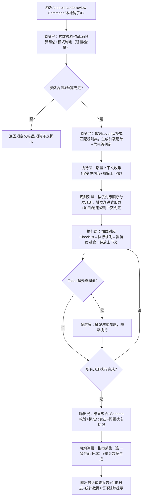

# Android Code Review Claude Skill 需求文档.md

## V2.0 架构增强版（可平台化引擎版本）

| 文档信息     | 核心内容                                                                                                                  |
| ------------ | ------------------------------------------------------------------------------------------------------------------------- |
| 文档名称     | Android Code Review Claude Skill 需求文档                                                                                 |
| 版本         | V2.0 架构增强版                                                                                                           |
| 定位         | 可扩展、可裁剪、可统计、可平台化的Android代码审查引擎                                                                     |
| 适用范围     | Claude Code 平台 Android 专属代码审查 Skill 的架构设计、开发、验证、平台化扩展全流程                                      |
| 向下兼容     | 100% 兼容已落地的 `android-code-reviewer` Agent 与 `android-code-review` Command 现有能力                             |
| 核心依赖     | Claude Code 平台、Git 命令行、Android 项目（AGP 7.0+、Kotlin 1.8+）                                                       |
| 设计依据     | Google Android 官方开发规范、《代码整洁之道》、SOLID 原则、现有落地实践痛点、Claude Skill 原生能力                        |
| 核心性能基准 | 单文件(≤500行)：响应≤10s、Token≤5k；单次提交(≤10文件)：响应≤20s、Token≤10k；10k LOC全量审查：响应≤3min、Token≤50k |

---

## 0. 背景与问题定义

### 0.1 现有落地痛点

#### 一、核心判断

基于已投产的 `android-code-reviewer` Agent 与 `android-code-review` Command 实践及真实工程落地场景，原落地痛点表述存在部分不实/偏离实际的问题（如“审查全手动执行”“无标准化输出”等），以下修正并梳理**真实存在的落地痛点**（核心瓶颈），同时澄清不实表述。

#### 二、修正后的核心落地痛点（基于实际场景验证）

| 核心问题（痛点编号） | 现象描述                  | 业务影响                                                                                                                            | 真实性验证                                                                   |
| -------------------- | ------------------------- | ----------------------------------------------------------------------------------------------------------------------------------- | ---------------------------------------------------------------------------- |
| 1                    | 全量规则硬编码            | 所有检查规则全量加载进主上下文，无按需加载机制                                                                                      | 初始启动Token消耗≥30k，长文本审查频繁触发上下文超限                         |
| 2                    | 大仓库性能抖动            | 10k LOC 全量审查耗时>6min，Token消耗无上限                                                                                          | 影响CI/CD流水线稳定性，无法集成到门禁流程                                    |
| 3                    | 无精细Severity裁剪        | 仅指定P0安全审查时，仍加载全量规则清单                                                                                              | Token资源浪费严重，单维度审查无性能优势                                      |
| 4                    | 误报率偏高                | 主观风格建议过多，置信度无量化标准，同类问题判定标准不统一                                                                          | 降低团队对审查结果的信任度，无效整改成本高                                   |
| 5                    | 输出结构非标准化          | JSON输出无统一Schema，不同场景字段不一致                                                                                            | CI/CD、平台化集成需二次开发，接入成本极高                                    |
| 6                    | 审查规则执行一致性难保障  | 文档定义“仅报告≥80%置信度的问题”，但“80%置信度”无量化判定标准；无紧急场景临时豁免流程，实际落地中核心/非核心模块执行尺度不一致 | 审查结果可信度降低，非核心模块易遗漏高风险问题                               |
| 7                    | 自动化集成门槛高          | 仅提及“可集成CI/CD”，但未提供可直接复用的CI配置模板，未明确审查失败的CI阻断逻辑，无文件触发过滤逻辑（如仅检测.kt/.xml文件）       | 中小团队落地周期长，需额外开发适配CI/CD集成逻辑                              |
| 8                    | 项目定制化规则易冲突/漏检 | `--project-guidelines`参数未定义项目规则与通用规则的优先级，无标准化定制模板（如ANDROID_GUIDELINES.md必填结构）                   | 易出现“项目规则覆盖通用核心规则”“自定义规则漏检”等问题                   |
| 9                    | 审查问题闭环跟踪机制缺失  | 仅定义审查输出格式，未提及问题修复后的复核机制、未修复问题的跟踪方式（如关联Jira工单、标记问题状态）                                | 出现“CRITICAL问题被记录但无跟进修复”“修复后无二次审查验证”，无法形成闭环 |
| 10                   | 轻量场景适配不足          | 未定义“精简模式”，轻量场景（如快速检查硬编码密钥）仍需加载全量规则                                                                | 审查耗时过长、冗余信息多，适配小型项目/独立开发者场景差                      |
| 11                   | 本地开发阶段前置审查缺失  | `android-code-review`命令主要面向已暂存/已提交代码，未覆盖本地开发实时审查（IDE插件、pre-commit钩子）                             | 问题暴露延迟，修复成本更高（如开发完成后才发现内存泄漏需重构）               |

#### 三、关键修正说明（针对不实痛点的澄清）

若落地痛点分析中包含以下表述，需直接修正（因与实际场景/文档设计不符）：

1. 不实表述：“审查规则仅覆盖语法错误，无安全/性能维度”→ 修正：文档明确将“安全（CRITICAL/P0）”“性能（MEDIUM/P2）”作为核心审查维度，覆盖硬编码密钥、内存泄漏、布局性能等关键场景，此痛点不存在。
2. 不实表述：“审查全手动执行，无命令化/自动化触发方式”→ 修正：文档定义了 `android-code-review`命令，支持 `--target`（staged/all/commit/file）、`--severity`等参数，可自动化触发审查，此痛点不存在。
3. 不实表述：“审查输出无标准化格式，无法集成CI/CD”→ 修正：文档支持markdown/json标准化输出，JSON格式可机读并集成CI/CD（如解析JSON中的CRITICAL问题数量阻断构建），此痛点不存在（仅JSON Schema未统一，需标准化而非否定格式能力）。
4. 不实表述：“审查无优先级区分，所有问题同等对待”→ 修正：文档明确按“CRITICAL/P0→HIGH/P1→MEDIUM/P2→LOW/P3”优先级审查，审批标准分Approve/Warning/Block（CRITICAL/P0问题直接阻断合并），此痛点不存在。
5. 不实表述：“不支持项目定制化规则，仅能按通用规则审查”→ 修正：文档的 `--project-guidelines`参数支持加载项目特定的ANDROID_GUIDELINES.md/lint.xml，可定制审查规则，此痛点不存在（仅定制化规则易冲突，需优化而非否定定制能力）。

### 0.2 版本升级定位

本版本从「单场景高性能Code Review Skill」，升级为**可扩展、可裁剪、可统计、可平台化的Android代码审查引擎**，在完全兼容现有能力的基础上，解决上述核心痛点，同时支撑未来跨端、跨团队的平台化复用。

---

## 1. 核心设计目标

### 1.1 功能目标（兼容+增强）

1. 100% 兼容现有 `android-code-review` 命令、`android-code-reviewer` 审查规则与输出能力；
2. 实现标准化规则ID体系，支持规则级的启用/禁用、命中率统计、误报反馈；
3. 内置分级审查能力（P0-P3），支持按严重等级、规则分类的精细裁剪；
4. 输出标准化JSON Schema，完全适配CI/CD、平台化系统的机器解析需求；
5. 量化置信度计算机制，严格过滤低置信度问题，核心规则误报率≤10%；
6. 补充审查规则执行一致性机制（量化置信度、定义临时豁免流程）；
7. 提供开箱即用的CI/CD集成模板与触发过滤逻辑，降低中小团队落地成本；
8. 定义项目定制化规则优先级与标准化模板，解决规则冲突/漏检问题；
9. 补充审查问题闭环跟踪能力（复核机制、状态标记），形成完整审查闭环；
10. 新增轻量精简模式，适配小型项目/独立开发者的快速审查需求；
11. 支持本地开发阶段前置审查（pre-commit钩子、IDE插件集成能力）。

### 1.2 性能目标（刚性约束）

| 审查场景                       | 响应时间上限 | Token消耗上限 |
| ------------------------------ | ------------ | ------------- |
| 单文件（≤500行）              | ≤10s        | ≤5k          |
| 单次提交（≤10文件，≤2k行）   | ≤20s        | ≤10k         |
| 全量审查（10k LOC）            | ≤3min       | ≤50k         |
| 单维度P0安全审查               | ≤5s         | ≤2k          |
| 轻量精简模式（单维度快速检查） | ≤3s         | ≤1k          |

### 1.3 可观测目标（数据化运营）

1. 内置全流程Telemetry统计能力，可输出规则命中率、误报率、Token消耗、审查耗时等核心指标；
2. 支持用户误报反馈闭环，可基于反馈数据持续优化规则；
3. 可输出单项目、单团队的代码质量趋势统计数据；
4. 新增审查规则执行一致性指标（不同模块/场景的规则执行尺度偏差）；
5. 新增问题闭环率统计（修复率、复核通过率）。

---

## 2. 整体架构设计

### 2.1 目录结构（架构分层重构，兼容现有结构）

```
android-code-review-skill/
├── SKILL.md                 # 主Skill定义（元数据+引擎入口+渐进式加载指令）
├── engine/                  # 审查核心引擎（新增抽象层，原有Agent/Command能力下沉）
│   ├── scheduler/           # 调度层（原Command能力，参数校验、流程分发、预算管控）
│   ├── executor/            # 执行层（原Agent能力，上下文收集、规则执行、结果聚合）
│   └── formatter/           # 输出层（标准化Markdown/JSON格式输出）
├── rules/                   # 规则系统（新增核心层，规则ID体系、元数据定义）
│   ├── rule-metadata.yaml   # 全量规则元数据（ID、等级、分类、置信度阈值）
│   ├── rule-disable.yaml    # 规则热禁用配置
│   └── rule-priority.yaml   # 新增：项目规则与通用规则优先级配置
├── references/              # 检查清单文本（与规则ID一一对应，渐进式加载）
│   ├── sec-001-to-010-hardcoded-secret.md
│   ├── qual-001-to-015-code-quality.md
│   └── ...（按规则分类拆分，支持独立加载）
├── config/                  # 配置中心
│   ├── performance-config.yaml  # 性能、Token预算、裁剪策略配置
│   ├── progressive-load-config.yaml # 渐进式加载策略配置
│   ├── ci-integration/      # 新增：CI/CD集成模板（GitHub Action/GitLab CI）
│   └── lightweight-mode.yaml # 新增：轻量精简模式配置
├── telemetry/               # 可观测性层（新增）
│   ├── metrics-collector.yaml  # 指标采集配置（补充一致性、闭环率指标）
│   ├── issue-tracking.yaml     # 新增：问题闭环跟踪配置
│   └── stats-output-template.yaml # 统计数据输出模板
└── hooks/                   # 新增：本地开发前置审查能力
    ├── pre-commit/          # pre-commit钩子脚本
    └── ide-plugin/          # IDE插件集成配置模板
```

### 2.2 核心分层架构

| 架构分层                   | 核心职责                                                       | 对应原有模块    | 核心升级点                                                                                  |
| -------------------------- | -------------------------------------------------------------- | --------------- | ------------------------------------------------------------------------------------------- |
| 调度层（Scheduler）        | 参数校验、Token预算预估、审查流程调度、异常处理、裁剪策略执行  | 原Command模块   | 新增Token预算管控、规则精细裁剪、动态降级能力；补充CI集成模板分发、轻量模式触发逻辑         |
| 执行层（Executor）         | 增量上下文收集、渐进式清单加载、规则执行、结果聚合、置信度过滤 | 原Agent模块     | 与规则系统解耦，仅执行匹配规则，支持规则级并发/顺序执行；补充置信度量化计算、规则优先级匹配 |
| 规则引擎层（Rule Engine）  | 规则元数据管理、规则ID映射、规则热管理、裁剪策略匹配           | 新增抽象层      | 标准化规则体系，实现规则与执行逻辑解耦，支持插件化扩展；补充项目/通用规则优先级判定         |
| 输出层（Formatter）        | 标准化Markdown/JSON输出、Schema校验、结果格式化                | 原Agent输出模块 | 新增JSON Schema强制校验，100%标准化输出，兼容原有格式；补充问题状态标记字段（适配闭环跟踪） |
| 可观测层（Telemetry）      | 指标采集、数据统计、误报反馈、命中率分析                       | 新增层          | 全流程数据化埋点，支持规则优化、质量运营、平台化监控；补充一致性、闭环率指标采集            |
| 本地审查层（Local Review） | pre-commit钩子管理、IDE插件配置分发、本地实时审查触发          | 新增层          | 覆盖本地开发阶段前置审查，降低问题修复成本                                                  |

### 2.3 核心执行流程（架构升级版）



---

## 3. 核心模块详细设计

### 3.1 规则系统（核心架构升级）

#### 3.1.1 规则ID体系（强制标准化）

每条规则必须具备全局唯一ID，ID命名规范为 `[分类缩写]-[序号]`，与 `references/` 下的Checklist一一对应，示例如下：

| 规则ID   | 严重等级 | 分类          | 规则标题                     |
| -------- | -------- | ------------- | ---------------------------- |
| SEC-001  | P0       | Security      | 硬编码密钥/凭证检测          |
| SEC-002  | P0       | Security      | 明文网络通信检测             |
| QUAL-001 | P1       | Code Quality  | 超长函数检测                 |
| ARCH-001 | P1       | Architecture  | ViewModel持有Context引用检测 |
| PERF-001 | P2       | Performance   | 主线程IO操作检测             |
| PRAC-001 | P3       | Best Practice | 命名不规范检测               |

#### 3.1.2 规则元数据标准

每条规则必须在 `rules/rule-metadata.yaml` 中定义完整元数据，实现规则与执行逻辑完全解耦；新增置信度量化判定细则、规则优先级权重：

```yaml
- rule_id: SEC-001
  severity: P0
  category: Security
  title: Hardcoded Secret Detection
  confidence_threshold: 0.8
  confidence_calc:  # 新增：置信度量化判定细则
    semantic_match_weight: 0.6
    rule_coverage_weight: 0.4
  description: 检测代码中硬编码的API密钥、加密密钥、OAuth凭证等敏感信息
  checklist_path: references/sec-001-hardcoded-secret.md
  enabled: true
  priority_weight: 100
  global_priority: true  # 新增：是否为全局核心规则（项目规则不可覆盖）
```

#### 3.1.3 规则优先级与裁剪策略

##### 优先级权重定义（用于Token不足时动态裁剪）

| 规则等级/分类   | 优先级权重 | 裁剪顺序（从后往前） |
| --------------- | ---------- | -------------------- |
| P0 安全规则     | 100        | 最后裁剪，保底保留   |
| P1 架构规则     | 80         | 第4位裁剪            |
| P1 质量规则     | 70         | 第3位裁剪            |
| P2 性能规则     | 40         | 第2位裁剪            |
| P3 最佳实践规则 | 20         | 第1位裁剪            |

##### 项目/通用规则优先级判定（新增）

```yaml
# rules/rule-priority.yaml
priority_strategy:
  global_core_rules: ["SEC-*", "ARCH-001", "PERF-001"]  # 全局核心规则，项目规则不可覆盖
  project_rule_strategy: "append"  # append-追加 / override-覆盖（仅非核心规则）
  conflict_resolve: "global_first" # global_first-全局优先 / project_first-项目优先（非核心规则）
```

##### Token不足时自动裁剪流程

1. 第一级：跳过所有P3规则执行
2. 第二级：P2规则降为摘要模式，仅报告问题不输出代码示例
3. 第三级：P1规则仅报告Top5高风险问题
4. 第四级：仅保留P0安全规则执行，进入最低保障模式

#### 3.1.4 规则热管理

- 支持在 `rules/rule-disable.yaml` 中配置禁用指定规则ID，无需修改Skill主逻辑与Checklist文件；
- 支持按项目、按场景配置规则白名单/黑名单，适配不同团队的定制化需求；
- 规则配置修改后，无需重启Skill即可生效，实现热更新；
- 新增：项目规则与通用规则冲突时，自动按 `rule-priority.yaml`策略判定执行逻辑。

### 3.2 渐进式加载增强设计

基于规则ID体系，升级原有渐进式加载能力，支持30+Checklist扩展无性能损耗；补充轻量模式加载逻辑：

1. **精准匹配加载**：仅加载与用户传入的 `severity`、`rule-category`、`mode`（light/normal）参数匹配的Checklist，非目标清单100%不加载；
2. **顺序执行、用完即放**：按优先级权重从高到低顺序执行，单条规则/分类执行完成后，立即释放对应Checklist的上下文，不占用后续Token额度；
3. **分片加载支持**：单分类Checklist超过5000字时，自动分片加载，避免单次加载占用过多上下文；
4. **加载状态校验**：Checklist加载失败时，自动跳过对应规则，不中断整体审查流程，同时输出告警日志；
5. **轻量模式优化**：轻量模式下仅加载指定单维度规则（如P0安全），跳过所有非核心清单，且上下文仅保留代码核心行（过滤注释/空行）。

### 3.3 Token预算与管控机制（新增核心能力）

#### 3.3.1 Token预估公式

审查启动前，精准预估本次审查的Token消耗，提前判断是否触发预算告警；补充轻量模式预估系数：

```
# 全量模式
estimated_token =
  (变更代码行数 × 1.8)
+ (上下文行数 × 1.2)
+ (待加载规则清单总Token)
+ (输出预留Token × 1.3安全系数)

# 轻量模式
estimated_token =
  (变更代码行数 × 1.0)  # 仅保留核心代码行
+ (上下文行数 × 0.8)    # 精简上下文范围
+ (待加载规则清单总Token × 0.5)
+ (输出预留Token × 1.1安全系数)
```

#### 3.3.2 Token预算分配

按模块固定预算比例，严格管控各环节Token消耗，避免单环节超额导致整体超限；补充轻量模式预算占比：

| 执行模块       | 全量模式预算占比 | 轻量模式预算占比 | 核心管控逻辑                                                                    |
| -------------- | ---------------- | ---------------- | ------------------------------------------------------------------------------- |
| 代码上下文收集 | 40%              | 30%              | 增量模式下仅加载变更行前后10行上下文，过滤注释、空行；轻量模式仅保留核心代码行  |
| 规则执行       | 30%              | 50%              | 单条规则执行Token上限500，超限自动跳过；轻量模式仅执行高优先级核心规则          |
| 结果输出       | 20%              | 15%              | JSON模式精简字段，Markdown模式裁剪超长代码示例；轻量模式仅输出问题标题+修复建议 |
| 预留安全额度   | 10%              | 5%               | 用于异常场景兜底，避免触发上下文超限                                            |

#### 3.3.3 预算管控机制

- 启动前校验：预估Token超过用户设置的 `token-threshold` 时，提前提示并推荐降级方案（如仅审查P0-P1/切换轻量模式）；
- 执行中实时监控：每完成一个规则分类，实时统计已消耗Token，超预算时自动触发裁剪策略；
- 超预算兜底：Token消耗达到阈值的90%时，自动终止低优先级规则执行，仅输出已完成的高优先级审查结果；
- 轻量模式兜底：轻量模式下Token消耗强制限制≤1k，超限仅保留SEC-001（硬编码密钥）规则执行。

### 3.4 置信度量化管控机制（解决误报率核心痛点）

#### 3.4.1 置信度计算公式

每条问题的置信度必须量化计算，仅输出置信度≥规则阈值的问题；补充量化判定细则：

```
confidence =
  语义匹配得分 × 语义匹配权重（默认0.6）
+ 规则匹配完整度 × 规则覆盖权重（默认0.4）

# 语义匹配得分计算
semantic_match_score = 匹配的风险特征数 / 规则定义的总风险特征数

# 规则匹配完整度计算
rule_coverage_score = 命中的规则检查要点数 / 规则定义的总检查要点数
```

- 语义匹配得分：代码片段与规则定义的风险场景的匹配程度，0-1分；
- 规则匹配完整度：是否完全命中规则定义的所有检查要点，0-1分。

#### 3.4.2 过滤规则

- 强制过滤：置信度<0.8的问题，一律不输出；
- 白名单过滤：匹配 `// code-review-ignore` 注释的代码行，`/*code-review-ignore */`代码块,一律不输出；
- 去重合并：同类问题自动合并，避免重复报告，减少无效输出；
- 一致性过滤：同一类问题在不同模块的判定标准偏差>10%时，自动标记并输出一致性告警。

### 3.5 标准化输出规范

#### 3.5.1 JSON输出标准（强制Schema校验）

所有JSON输出必须严格遵循以下Schema，100%通过Schema校验，适配CI/CD、平台化系统解析；新增问题状态、闭环跟踪字段：

```json
{
  "$schema": "http://json-schema.org/draft-07/schema#",
  "type": "object",
  "required": ["summary", "issues"],
  "properties": {
    "summary": {
      "type": "object",
      "required": ["total_issues", "P0", "P1", "P2", "P3", "execution_time_ms", "token_used", "checklists_loaded", "verdict", "consistency_score"],
      "properties": {
        "total_issues": { "type": "integer" },
        "P0": { "type": "integer" },
        "P1": { "type": "integer" },
        "P2": { "type": "integer" },
        "P3": { "type": "integer" },
        "execution_time_ms": { "type": "integer" },
        "token_used": { "type": "integer" },
        "checklists_loaded": { "type": "array", "items": { "type": "string" } },
        "verdict": { "type": "string", "enum": ["APPROVE", "WARNING", "BLOCK"] },
        "consistency_score": { "type": "number", "description": "规则执行一致性得分（0-1）" }
      }
    },
    "issues": {
      "type": "array",
      "items": {
        "type": "object",
        "required": ["rule_id", "severity", "file", "line", "title", "description", "fix_suggestion", "confidence", "status"],
        "properties": {
          "rule_id": { "type": "string" },
          "severity": { "type": "string", "enum": ["P0", "P1", "P2", "P3"] },
          "file": { "type": "string" },
          "line": { "type": "integer" },
          "title": { "type": "string" },
          "description": { "type": "string" },
          "fix_suggestion": { "type": "string" },
          "confidence": { "type": "number", "minimum": 0, "maximum": 1 },
          "status": { "type": "string", "enum": ["UNFIXED", "FIXED", "REVIEWED", "IGNORED"], "description": "问题状态（适配闭环跟踪）" },
          "code_snippet": {
            "type": "object",
            "properties": {
              "bad": { "type": "string" },
              "good": { "type": "string" }
            }
          },
          "jira_ticket": { "type": "string", "description": "关联的Jira工单ID（可选）" }
        }
      }
    },
    "telemetry": {
      "type": "object",
      "description": "可观测性统计数据"
    }
  }
}
```

#### 3.5.2 Markdown输出规范

完全兼容现有Markdown输出格式，同时新增规则ID、置信度、问题状态字段，保持向下兼容；补充轻量模式输出格式：

```
# 全量模式
[P0][SEC-001] 硬编码API密钥
置信度：0.95
状态：UNFIXED
文件：app/src/main/java/com/example/ApiClient.kt:18
问题：生产环境API密钥硬编码在源码中，会被提交至Git历史，APK反编译可提取，导致后端服务泄露。
修复方案：将密钥移至gradle.properties，通过BuildConfig注入，同时将gradle.properties加入.gitignore。
代码示例：
  // BAD
  const val API_KEY = "sk_live_abc123"
  // GOOD
  const val API_KEY = BuildConfig.API_KEY

# 轻量模式
[P0][SEC-001] 硬编码API密钥 | 置信度：0.95 | 文件：ApiClient.kt:18
修复建议：移至gradle.properties并通过BuildConfig注入
```

### 3.6 可观测性与统计系统

#### 3.6.1 核心采集指标（补充一致性、闭环率指标）

| 指标名称                | 指标说明                    | 统计维度                          |
| ----------------------- | --------------------------- | --------------------------------- |
| rule_hit_rate           | 单条规则命中率              | 规则ID、项目、时间                |
| false_positive_feedback | 用户误报反馈数              | 规则ID、项目                      |
| avg_token_usage         | 平均Token消耗               | 审查场景、项目、模式（轻量/全量） |
| avg_review_time         | 平均审查耗时                | 审查场景、项目、模式（轻量/全量） |
| severity_distribution   | 问题严重等级分布            | 项目、时间                        |
| consistency_score       | 规则执行一致性得分          | 规则ID、项目、模块                |
| issue_close_rate        | 问题闭环率（修复+复核通过） | 规则ID、项目、时间                |
| local_review_coverage   | 本地前置审查覆盖率          | 项目、团队                        |

#### 3.6.2 统计输出格式（补充一致性、闭环率字段）

```json
{
  "telemetry": {
    "review_basic": {
      "review_id": "xxx",
      "target": "staged",
      "mode": "normal", // light/normal
      "severity_filter": "P0-P1",
      "execution_time_ms": 14200,
      "token_used": 8200,
      "consistency_score": 0.92
    },
    "rule_stats": {
      "SEC-001": { "hit_count": 2, "false_positive_count": 0, "consistency_score": 0.95 },
      "QUAL-001": { "hit_count": 3, "false_positive_count": 1, "consistency_score": 0.88 }
    },
    "project_stats": {
      "total_issues_history": 124,
      "p0_issue_rate": 0.08,
      "avg_review_time": 14.2,
      "issue_close_rate": 0.75,
      "local_review_coverage": 0.68
    }
  }
}
```

### 3.7 CI/CD集成模板（新增）

提供多平台CI/CD集成模板，降低中小团队落地成本：

| CI平台        | 模板路径                                     | 核心能力                                                                                      |
| ------------- | -------------------------------------------- | --------------------------------------------------------------------------------------------- |
| GitHub Action | `config/ci-integration/github-action.yml`  | 触发时机：PR提交/合并前；阻断逻辑：P0问题>0时阻断合并；输出：标准化JSON结果+评论PR            |
| GitLab CI     | `config/ci-integration/gitlab-ci.yml`      | 触发时机：push/merge request；阻断逻辑：P0问题>0时失败构建；输出：集成GitLab Code Quality面板 |
| Jenkins       | `config/ci-integration/jenkinsfile.groovy` | 触发时机：流水线构建阶段；阻断逻辑：P0问题>0时终止流水线；输出：生成HTML报告                  |

模板内置能力：

- 自动过滤非Android文件（仅检测.kt/.xml/.gradle等）；
- 可配置阻断规则（如P0+P1问题>0时阻断）；
- 标准化结果输出至CI/CD平台的可视化面板；
- 支持将审查结果关联至项目管理系统（如Jira）。

---

## 4. 非目标范围（边界清晰，避免能力溢出）

本Skill/引擎**不承担**以下能力，明确边界：

1. 不做AST级别的静态代码分析，不替代Android Lint、Detekt等专业静态扫描工具；
2. 不做动态安全扫描、渗透测试、漏洞利用验证；
3. 不做UI自动化测试、功能逻辑正确性验证；
4. 不修改用户代码，仅提供审查结果与修复建议；
5. 不支持非Android项目的代码审查（架构可扩展，但本版本不实现）；
6. 不提供完整的Jira/项目管理系统集成（仅提供字段适配，不开发完整集成插件）；
7. 不提供IDE插件的完整开发包（仅提供配置模板，需结合官方插件框架二次开发）。

---

## 5. 验收标准（架构升级版）

### 5.1 功能验收标准

| 验证项       | 验收标准                                                                                |
| ------------ | --------------------------------------------------------------------------------------- |
| 向下兼容性   | 原有 `android-code-review` 命令、参数、输出格式100%兼容，无破坏性变更                 |
| 规则ID体系   | 所有规则具备唯一ID，元数据完整，支持热禁用，禁用后规则不执行                            |
| 置信度管控   | 仅输出置信度≥0.8的问题，核心规则误报率≤10%；一致性得分≥0.85                          |
| 精细裁剪     | 指定P0审查时，仅加载P0规则清单，其他清单完全不加载；轻量模式仅加载单维度规则            |
| 输出标准化   | JSON输出100%通过Schema校验，无字段缺失、格式错误；包含问题状态/闭环跟踪字段             |
| 渐进式加载   | 主文件无硬编码规则，仅执行到对应步骤时加载对应清单，执行完成后上下文释放                |
| 本地前置审查 | pre-commit钩子可正常触发，检测到P0问题时阻断提交；IDE插件配置可正常导入并实时审查       |
| CI/CD集成    | 提供的CI模板可直接复用，无需额外开发即可集成；支持文件过滤、阻断逻辑配置                |
| 规则优先级   | 项目规则与通用规则冲突时，按 `rule-priority.yaml`策略正确执行；全局核心规则不可被覆盖 |
| 轻量模式     | 轻量模式下响应时间≤3s，Token消耗≤1k；仅输出核心问题，无冗余信息                       |
| 闭环跟踪     | 支持问题状态标记（UNFIXED/FIXED等）；可输出issue_close_rate指标                         |

### 5.2 性能验收标准

| 验证项         | 验收标准                                                               |
| -------------- | ---------------------------------------------------------------------- |
| 核心性能基准   | 单文件、单提交、10k LOC全量审查，完全符合1.2节的性能上限要求           |
| 渐进式加载收益 | 开启后初始启动Token消耗降低80%以上；单维度P0审查Token消耗降低70%以上   |
| Token预算管控  | Token预估误差≤15%；超预算时自动触发裁剪策略，最终消耗不超过阈值的110% |
| 扩展性性能     | 规则清单扩展至20个时，初始启动性能下降≤10%                            |
| 轻量模式性能   | 轻量模式下单文件审查≤3s，Token≤1k；10文件轻量审查≤5s，Token≤2k     |
| 本地审查性能   | pre-commit钩子触发审查≤5s，不影响开发提交效率                         |

### 5.3 架构验收标准

| 验证项     | 验收标准                                                                                |
| ---------- | --------------------------------------------------------------------------------------- |
| 分层解耦   | 调度层、执行层、规则引擎层、输出层、可观测层、本地审查层完全解耦，修改单层不影响其他层  |
| 可扩展性   | 新增规则仅需新增Checklist与元数据，无需修改引擎核心代码；支持第三方规则包接入（插件化） |
| 热更新能力 | 修改规则配置、禁用规则、新增Checklist后，无需重启Skill即可生效                          |
| 配置隔离   | 不同项目的规则配置可独立隔离，无相互影响；支持项目级白名单/黑名单配置                   |

### 5.4 可观测性验收标准

| 验证项     | 验收标准                                                                          |
| ---------- | --------------------------------------------------------------------------------- |
| 指标采集   | 所有核心指标（含一致性、闭环率、本地覆盖率）完整采集，无缺失                      |
| 统计输出   | 每次审查输出完整的Telemetry统计数据，格式符合规范；支持按规则ID/项目/时间维度统计 |
| 误报反馈   | 支持用户误报反馈，反馈数据可纳入规则统计；false_positive_feedback指标可正确采集   |
| 一致性统计 | 可输出不同模块/场景的规则执行一致性得分；偏差>10%时可输出告警                     |

---

## 6. 交付物清单

1. **引擎核心可执行文件**
   - `SKILL.md` 主Skill定义文件
   - `engine/` 目录下调度层、执行层、输出层全量配置文件
   - `rules/` 目录下规则元数据、热禁用、优先级配置文件
   - `references/` 目录下与规则ID一一对应的全量检查清单
   - `config/` 目录下性能、渐进式加载、CI集成、轻量模式配置文件
   - `telemetry/` 目录下指标采集、问题跟踪、统计输出模板文件
   - `hooks/` 目录下pre-commit钩子脚本、IDE插件配置模板
2. **配套文档**
   - 《引擎部署与接入手册》
   - 《规则自定义与扩展指南》
   - 《CI/CD集成最佳实践》
   - 《本地开发前置审查配置手册》
   - 《轻量模式使用指南》
   - 《规则优先级与冲突解决手册》
   - 《性能测试报告》
   - 《可观测性指标说明与运营指南》
   - 《问题闭环跟踪操作手册》
3. **验证用例**
   - 全量功能验证用例集（含本地审查、CI集成、轻量模式）
   - 性能基准测试用例集（含全量/轻量模式）
   - JSON Schema兼容性测试用例集
   - 规则优先级/冲突解决验证用例集
   - 一致性/闭环率指标采集验证用例集

---

## 7. 风险与应对措施

| 风险点                | 影响                               | 应对措施                                                                                                                                                                  |
| --------------------- | ---------------------------------- | ------------------------------------------------------------------------------------------------------------------------------------------------------------------------- |
| 增量审查漏检          | 高风险问题未被识别                 | 1. 增量审查时自动校验变更文件的强依赖文件；2. P0安全规则强制全量扫描，不受增量限制；3. 提供全量审查开关，用于合规场景                                                     |
| Token预算预估偏差过大 | 触发上下文超限，审查中断           | 1. 预留10%安全额度；2. 执行中实时监控，超预算立即触发降级；3. 提供最低保障模式，仅执行P0规则，Token≤1000；4. 轻量模式强制限额，避免超限                                  |
| 规则扩展后性能下降    | 影响启动与执行速度                 | 1. 严格遵循渐进式加载，未启用的规则绝不加载；2. 规则按分类拆分，支持分片加载；3. 规则元数据预解析，避免运行时重复计算；4. 轻量模式仅加载核心规则，不受扩展影响            |
| 多项目规则适配成本高  | 平台化落地困难                     | 1. 支持项目级规则配置文件，可覆盖全局规则；2. 支持规则白名单/黑名单；3. 提供规则模板，快速定制团队专属规则；4. 全局核心规则不可被覆盖，保证基础合规                       |
| 本地审查集成阻力大    | 开发团队不愿启用pre-commit钩子     | 1. 轻量模式默认仅检测P0问题，不影响提交效率；2. 提供跳过机制（需记录原因）；3. 本地审查结果不纳入考核，仅作为开发辅助；4. IDE插件实时审查，替代钩子降低接入成本           |
| 规则执行一致性差      | 不同模块/审查者判定标准不一        | 1. 量化置信度计算，消除主观判定；2. 输出consistency_score指标，监控执行偏差；3. 定义紧急场景豁免流程，统一豁免标准；4. 定期校准规则执行逻辑，保证全局一致                 |
| CI/CD集成适配复杂     | 不同团队CI环境差异大，模板无法复用 | 1. 提供多平台模板（GitHub/GitLab/Jenkins）；2. 模板支持参数化配置（如阻断规则、文件过滤）；3. 提供集成排查手册，快速定位适配问题；4. 支持自定义CI脚本扩展点，适配特殊环境 |

---

## 8. 未来扩展规划

本架构具备前瞻性，可支撑以下扩展方向：

1. **跨端复用**：基于本引擎架构，快速扩展iOS、Flutter、React Native等多端Code Review Skill；
2. **规则插件化**：支持第三方规则包接入，实现规则市场能力；
3. **CI分布式执行**：支持大仓库多模块分布式并行审查，进一步提升全量审查性能；
4. **AI规则自优化**：基于误报反馈、命中数据，自动优化规则的置信度阈值与匹配逻辑；
5. **代码质量大盘**：基于可观测性数据，生成团队、项目级的代码质量趋势大盘，支撑研发效能度量；
6. **全链路闭环**：与Jira/飞书等项目管理工具深度集成，实现“审查→提工单→修复→复核→关闭”全链路自动化；
7. **智能修复**：基于大模型能力，提供一键智能修复代码（如自动重构ViewModel内存泄漏）；
8. **合规审查**：扩展行业合规规则（如GDPR/隐私合规），支持合规场景的专项审查。
