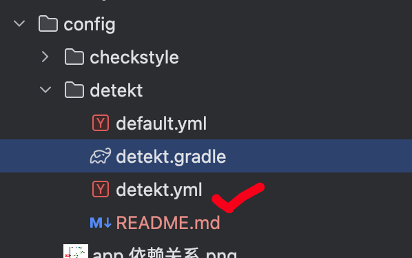

# Detekt 配置指南

## 问题说明

### 为什么必须使用 `-PcheckCodeStyle` 参数？

在项目中运行 Detekt 时，必须使用以下命令：

```bash
./gradlew detekt -PcheckCodeStyle
```

如果直接运行 `./gradlew detekt`，会遇到类似 [detekt/#7883](https://github.com/detekt/detekt/issues/7883) 的问题：

```
detekt was compiled with Kotlin 2.0.21 but is currently running with 2.1.0
```

#### 根本原因分析

**Kotlin 版本冲突的深层原因：**

1. **Detekt 的 Kotlin 版本依赖**
   - Detekt 1.23.8 在编译时使用的是 Kotlin 2.0.21
   - Detekt 插件会在构建时创建一个隔离的类加载环境
   - 这个环境需要与项目主构建环境分离

2. **项目构建配置的复杂性**
   - `force_dependency.gradle` 文件中包含很多强制的 verison 指定，其中就包括 kotlin
   
     ```groovy
     ……
     // kotlin_version = 2.1.0
     if (group == 'org.jetbrains.kotlin') {
         details.useVersion libs.kotlin_version
     }
     ……
     ```
   
   - 由于前置版本升级，detekt 在运行时
   
3. **版本冲突的发生机制**
   
   ```
   正常构建流程：
   ┌─────────────────────────────────────────────────────────┐
   │ 1. 加载 force_dependency.gradle                         │
   │ 2. 执行 resolutionStrategy.eachDependency               │
   │ 3. 应用 flavors.gradle                                  │
   │ 4. 所有模块使用统一版本指定策略                             │
   │ 5. Detekt 插件受到影响，使用了错误的 kotlin 版本            │
   │    ↓                                                    │
   │  Kotlin 版本解析冲突 → Detekt 加载失败                     │
   └─────────────────────────────────────────────────────────┘
   ```

**`-PcheckCodeStyle` 参数的解决机制：**

项目的构建配置设计了一个巧妙的开关机制：

```groovy
// force_dependency.gradle:6-8
if (project.hasProperty("checkCodeStyle")) {
    return  // 跳过后续逻辑
}
```

**当设置 `-PcheckCodeStyle` 时的执行流程：**

```
┌─────────────────────────────────────────────────────────┐
│ 使用 -PcheckCodeStyle 参数                              │
├─────────────────────────────────────────────────────────┤
│ 1. 检测到 checkCodeStyle 属性                           │
│ 2. 跳过 force_dependency.gradle 的依赖强制解析          │
│ 3. 跳过 flavors.gradle 的应用                           │
│ 4. Detekt 的 kotlin 环境未受到破坏                        │
│    ↓                                                    │
│  避免版本冲突 → Detekt 正常工作                         │
└─────────────────────────────────────────────────────────┘
```

**技术细节：**

- `checkCodeStyle` 属性充当了一个构建模式切换器
- 代码检查模式下，跳过所有与业务逻辑相关的复杂配置
- Detekt 可以使用自己编译时的 Kotlin 版本，不受项目版本影响
- 这是一个"关注点分离"的设计模式：代码检查与业务构建解耦

**为什么这个方案有效：**

1. **隔离性**：Detekt 在独立环境中运行，不受项目构建配置干扰
2. **轻量化**：代码检查时不需要完整的 flavor 配置和依赖解析
3. **兼容性**：避免了 Detekt 的 Kotlin 版本与项目版本冲突
4. **性能**：简化的构建配置加快了检查速度

---

## Gradle 中配置代码检测工具

### 1. Detekt 配置，以下是 legacy 的 gradle 写法：

#### 在项目的根 build.gradle 中添加插件

```groovy
// build.gradle
dependencies {
    classpath "io.gitlab.arturbosch.detekt:detekt-gradle-plugin:1.23.8"
}
```

#### 并在 allprojects 闭包里面应用自定义 plugin

```groovy
allprojects {
    ……
      apply from:  rootProject.file("config/detekt/detekt.gradle")
    ……
}
```

#### Detekt 专用配置文件

**detekt.gradle** - Detekt 插件配置：

```groovy
// kotlin Code Style
// https://detekt.dev/docs/1.23.8/gettingstarted/gradle

apply plugin: 'io.gitlab.arturbosch.detekt'

detekt {
    // failFast = true     // fail build on any finding
    config = rootProject.files("config/detekt/detekt.yml") // 规则配置文件
    buildUponDefaultConfig = true

    reports {
        html.enabled = true // observe findings in your browser with structure and code snippets
        xml.enabled = false // checkstyle like format mainly for integrations like Jenkins
        txt.enabled = true  // similar to the console output, contains issue signature to manually edit baseline files
    }
}

tasks.named("detekt").configure {
    reports {
        xml.required.set(false)
        html.required.set(true)
        sarif.required.set(false)
        md.required.set(false)
    }
}

// Groovy dsl
tasks.detekt.jvmTarget = "1.8"
```

**关键配置说明：**

- `config` - 指向规则配置文件
- `buildUponDefaultConfig` - 在默认配置基础上叠加自定义规则
- `parallel` - 启用并行分析以提升性能
- `reports` - 配置报告生成格式

### 2. Checkstyle 配置

1. 可以通过命令 ` ./gradlew detektGenerateConfig -PcheckCodeStyle ` 生成默认的 config 文件

   

2. 运行 `./gradlew detekt -PcheckCodeStyle` 将会生成报表，感觉报告出来的问题判断如何处理。

### 3. Pre-commit Hook 集成

#### 配置 Git Hook

**config/pre-commit** - 提交前自动检查：

```bash
#!/usr/bin/env bash
#
# 方案一： https://arturbosch.github.io/detekt/git-pre-commit-hook.html
# 将该文件放到project根目录的.git/hooks/目录下，执行 chmod +x pre-commit 为脚本添加可执行权限即可，
# 之后的每次commit都会先执行 checkstyle task 进行代码检查
#
# 方案二： https://stackoverflow.com/questions/427207/can-git-hook-scripts-be-managed-along-with-the-repository
# 从git 2.9开始, 可以设置:core.hooksPath了.
# 可以在repo里面添加一个目录hooks, 然后把git hooks文件放进去track.
# 在命令行跑:
# git config core.hooksPath [文件路径]
# 把找hook文件的目录设置成指定目录就好了.

set -e

# 颜色定义
RED='\033[0;31m'
GREEN='\033[0;32m'
YELLOW='\033[1;33m'
NC='\033[0m' # No Color

echo -e "${YELLOW}🔍 Running pre-commit checks...${NC}"

# ============================================
# 1. 检查暂存区是否有 Kotlin 或 Java 文件
# ============================================
# 全局变量存储文件列表
KOTLIN_FILES=""
JAVA_FILES=""

check_kotlin_java_files() {
  # 获取暂存区和工作区中的 .kt 和 .java 文件
  local staged_kotlin=$(git diff --cached --name-only --diff-filter=ACM | grep -E '\.kt$' || true)
  local staged_java=$(git diff --cached --name-only --diff-filter=ACM | grep -E '\.java$' || true)
  local modified_kotlin=$(git diff --name-only --diff-filter=ACM | grep -E '\.kt$' || true)
  local modified_java=$(git diff --name-only --diff-filter=ACM | grep -E '\.java$' || true)

  # 合并暂存区和工作区的文件（去重）
  KOTLIN_FILES=$(echo -e "$staged_kotlin\n$modified_kotlin" | sort -u | grep -v '^$' || true)
  JAVA_FILES=$(echo -e "$staged_java\n$modified_java" | sort -u | grep -v '^$' || true)

  if [[ -z "$KOTLIN_FILES" && -z "$JAVA_FILES" ]]; then
    echo -e "${GREEN}✓ No Kotlin or Java files changed, skipping code quality checks${NC}"
    return 1  # 没有需要检查的文件
  fi

  echo -e "${GREEN}✓ Found Kotlin/Java files to check:${NC}"
  [[ -n "$KOTLIN_FILES" ]] && echo "  Kotlin: $(echo "$KOTLIN_FILES" | wc -l | tr -d ' ') files"
  [[ -n "$JAVA_FILES" ]] && echo "  Java:   $(echo "$JAVA_FILES" | wc -l | tr -d ' ') files"
  return 0  # 有文件需要检查
}

# 检查是否需要运行 Detekt
need_detekt() {
  [[ -n "$KOTLIN_FILES" ]]
}

# 检查是否需要运行 Checkstyle
need_checkstyle() {
  [[ -n "$JAVA_FILES" ]]
}

# ============================================
# 2. 执行 Detekt 检查
# ============================================
run_detekt() {
  echo -e "${YELLOW}🔎 Running Detekt (Kotlin code quality)...${NC}"
  ./gradlew detekt -PcheckCodeStyle -q
  local exit_code=$?

  if [ $exit_code -ne 0 ]; then
    echo -e "${RED}***********************************************${NC}"
    echo -e "${RED}              Detekt failed                  ${NC}"
    echo -e "${RED} Please fix the above issues before committing ${NC}"
    echo -e "${RED}***********************************************${NC}"
    return 1
  fi

  echo -e "${GREEN}✓ Detekt passed${NC}"
  return 0
}

# ============================================
# 4. 执行 Checkstyle 检查
# ============================================
run_checkstyle() {
  echo -e "${YELLOW}🔎 Running Checkstyle (Java code quality)...${NC}"
  ./gradlew checkstyle -PcheckCodeStyle -q
  local exit_code=$?

  if [ $exit_code -ne 0 ]; then
    echo -e "${RED}***********************************************${NC}"
    echo -e "${RED}             Checkstyle failed                ${NC}"
    echo -e "${RED} Please fix the above issues before committing ${NC}"
    echo -e "${RED}***********************************************${NC}"
    return 1
  fi

  echo -e "${GREEN}✓ Checkstyle passed${NC}"
  return 0
}

# ============================================
# 主流程
# ============================================

# 1. 检查是否有 Kotlin/Java 文件改动
if ! check_kotlin_java_files; then
  # 没有代码改动，直接通过
  echo -e "${GREEN}✅ Pre-commit checks passed (no code to check)${NC}"
  exit 0
fi

# 2. 根据文件类型选择性执行检查
exit_code=0

if need_detekt; then
  if ! run_detekt; then
    exit_code=1
  fi
fi

if need_checkstyle; then
  if ! run_checkstyle; then
    exit_code=1
  fi
fi

# 3. 最终结果
if [ $exit_code -eq 0 ]; then
  echo -e "${GREEN}✅ All pre-commit checks passed!${NC}"
  exit 0
else
  exit 1
fi
```

#### 安装 Pre-commit Hook

```bash
# 复制到 .git/hooks/
cp config/pre-commit .git/hooks/pre-commit
chmod +x .git/hooks/pre-commit
```

## 配置文件说明

### detekt.yml - 规则配置

Detekt 的规则配置文件，定义了所有检查规则和阈值。

**配置策略：**

项目采用了**宽松但渐进式**的配置策略：
- 关键问题（如空安全、内存泄漏）严格检查
- 代码风格问题适度宽松，避免影响开发效率
- 标注了大量待改进项，为后续重构提供方向

**主要规则分类：**

#### 1. 潜在 Bug (potential-bugs)
- `UnsafeCallOnNullableType` - 空类型上的不安全调用
- `UnsafeCast` - 不安全的类型转换
- `UnreachableCode` - 不可达代码
- `EqualsWithHashCodeExist` - 必须同时实现 equals 和 hashCode

#### 2. 复杂度 (complexity)
- `LargeClass` - 类过大（阈值：800 行）
- `LongMethod` - 方法过长（阈值：100 行）
- `NestedBlockDepth` - 嵌套深度（阈值：4 层）

#### 3. 协程 (coroutines)
- `InjectDispatcher` - 显式注入 Dispatcher
- `RedundantSuspendModifier` - 冗余的 suspend 修饰符
- `SleepInsteadOfDelay` - 使用 delay 而非 sleep

#### 4. 代码风格 (style)
- `ForbiddenVoid` - 避免使用 Void 类型
- `MayBeConst` - 可以改为 const val
- `ModifierOrder` - 修饰符顺序
- `VarCouldBeVal` - 可以改为 val

#### 暂时禁用的规则

以下规则暂时禁用，标注了待改进项：

- `MagicNumber` - 魔法数字（待代码重构时处理）
- `MaxLineLength` - 最大行长度（待代码格式化时处理）
- `UnusedPrivateMember` - 未使用的私有成员（大量遗留，待清理）
- `ReturnCount` - 返回语句数量（允许多个返回）

---

## 报告输出

### HTML 报告

Detekt 会生成 HTML 格式的报告，包含：
- 问题摘要统计
- 按文件分组的问题详情
- 代码片段和行号
- 问题严重程度

**报告位置：** `app/build/reports/detekt/detekt.html`

### 文本报告

生成简洁的文本格式报告，适合 CI/CD 集成。

**报告位置：** `app/build/reports/detekt/detekt.txt`

### 在浏览器中查看报告

```bash
# macOS
open app/build/reports/detekt/detekt.html

# Linux
xdg-open app/build/reports/detekt/detekt.html

# Windows
start app/build/reports/detekt/detekt.html
```

---

## 常见问题

### Q: 为什么有些规则明明违反了但没有报错？

A: 检查 `detekt.yml` 中该规则的 `active` 是否为 `true`。很多规则为了渐进式改进，暂时设为 `false`。

### Q: 如何忽略某个文件的特定检查？

A: 使用 `@Suppress` 注解：

```kotlin
@Suppress("MagicNumber")
fun myFunction() {
    val x = 12345  // 不会报错
}
```

### Q: Detekt 影响构建速度吗？

A: Detekt 只在代码检查时运行，不会影响正常构建。使用 `-PcheckCodeStyle` 参数可以跳过不必要的配置，提高检查速度。

### Q: 如何在 CI/CD 中集成？

A: 在 CI 脚本中添加：

```bash
./gradlew detekt -PcheckCodeStyle -q
if [ $? -ne 0 ]; then
    echo "Detekt 检查失败"
    exit 1
fi
```

### Q: 升级 Kotlin 版本后 Detekt 报错怎么办？

A: 使用 `-PcheckCodeStyle` 参数可以避免版本冲突。如果问题持续，等待 Detekt 发布支持新 Kotlin 版本的更新。

---

## 参考资源

- [Detekt 官方文档](https://detekt.dev/)
- [Detekt 规则说明](https://detekt.dev/docs/introduction/rules)
- [GitHub Issue #7883](https://github.com/detekt/detekt/issues/7883) - checkCodeStyle 参数相关
- [项目构建配置](../../build.gradle)
- [依赖强制解析](../../force_dependency.gradle)
- [Checkstyle 官方文档](https://checkstyle.org/)

---

## 版本信息

- **Detekt 版本:** 1.23.8
- **Checkstyle 版本:** 8.45
- **Kotlin 版本:** 2.1.0 (项目), 2.0.21 (Detekt 编译)
- **配置文件:** config/detekt/detekt.yml
- **Gradle 插件:** io.gitlab.arturbosch.detekt
- **最后更新:** 2025-02-10